# AWS Receipt Processing Lambda Function

This project uses **AWS Textract**, **DynamoDB**, **SES**, and **S3** to automatically process receipt images uploaded to an S3 bucket. When a new receipt is uploaded, this Lambda function:

1. Extracts structured data using **Amazon Textract**
2. Saves the extracted data to **DynamoDB**
3. Sends an HTML-formatted email notification using **Amazon SES**


## Architecture Overview


## Features

- Triggered automatically by new S3 uploads
- Intelligent field extraction using `analyze_expense` API from Textract
- Saves full receipt metadata and line items to DynamoDB
- HTML email notifications with vendor, total, date, and item breakdown
- Resilient error handling with clear logs
- Easy to configure using environment variables


## Technologies Used

- **AWS Lambda**
- **Amazon Textract**
- **Amazon S3**
- **Amazon DynamoDB**
- **Amazon SES**
- **Python 3.9**


## Setup Instructions

### 1. Prerequisites

- AWS account
- Verified email in Amazon SES (for both sender and recipient)
- IAM Role with permissions for:
  - Textract: `textract:AnalyzeExpense`
  - S3: `s3:GetObject`, `s3:HeadObject`
  - DynamoDB: `dynamodb:PutItem`
  - SES: `ses:SendEmail`

### 2. Environment Variables

Configure the following Lambda environment variables:

| Variable             | Description                                |
|----------------------|--------------------------------------------|
| `DYNAMODB_TABLE`     | Name of the DynamoDB table (e.g. `Receipts`) |
| `SES_SENDER_EMAIL`   | Verified SES sender address                 |
| `SES_RECIPIENT_EMAIL`| Destination email for receipt summaries     |


## Project Structure

```bash
.
├── lambda.py
├── Lambda Function Explanation.pdf
├── README.md
└── screenshots/
```

## Screenshots

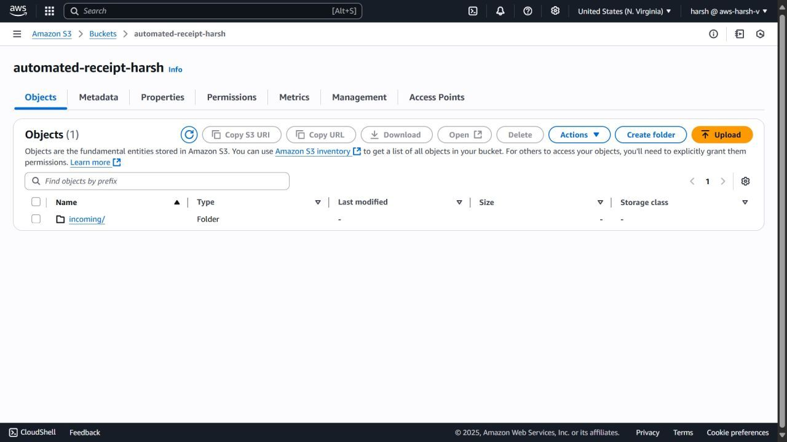
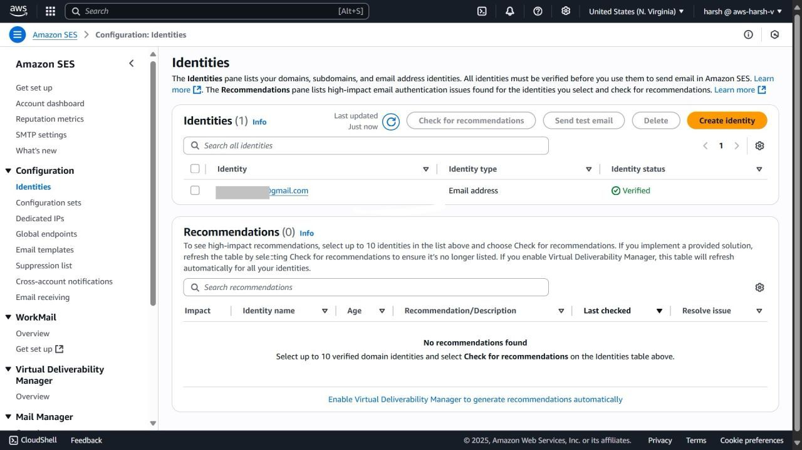
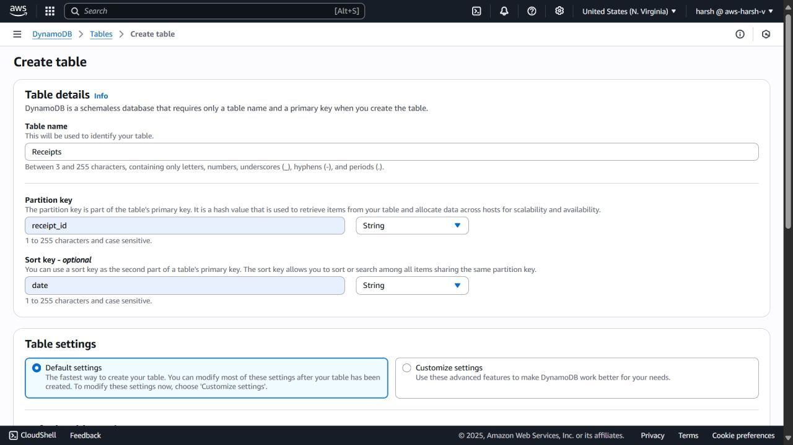
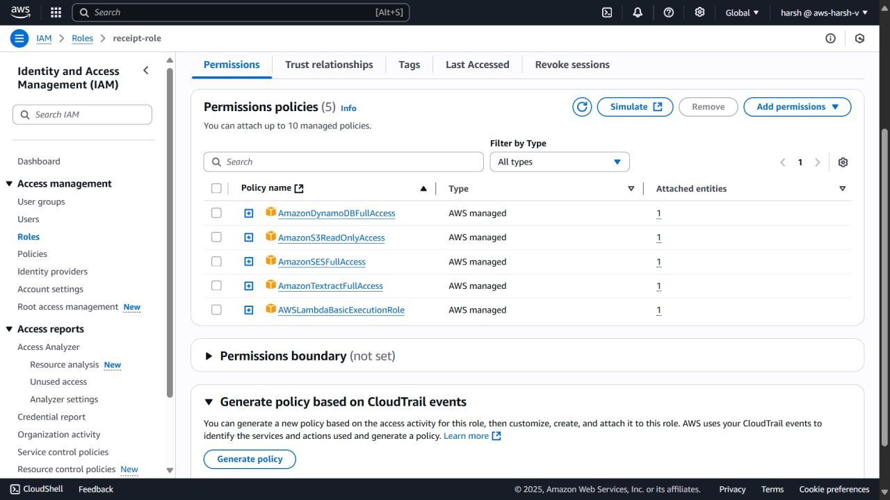
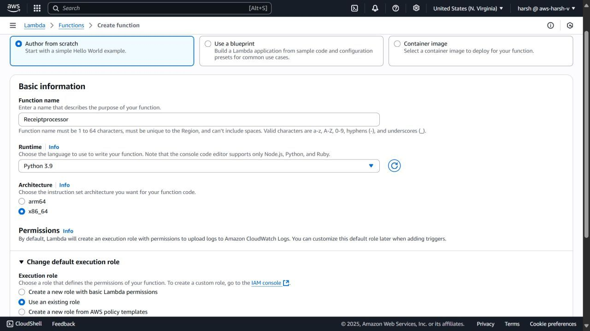
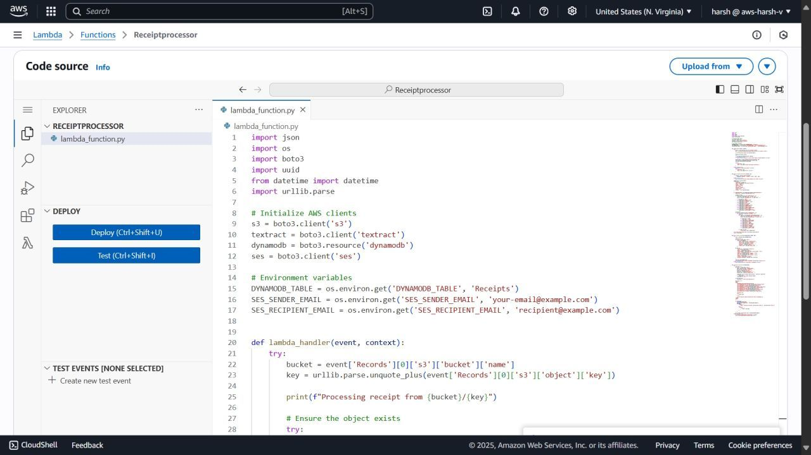
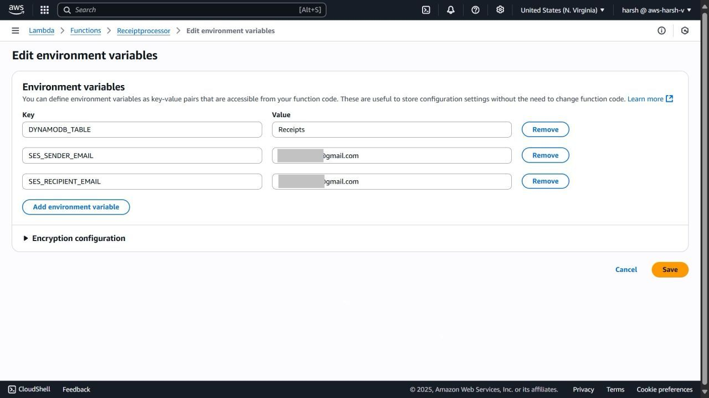
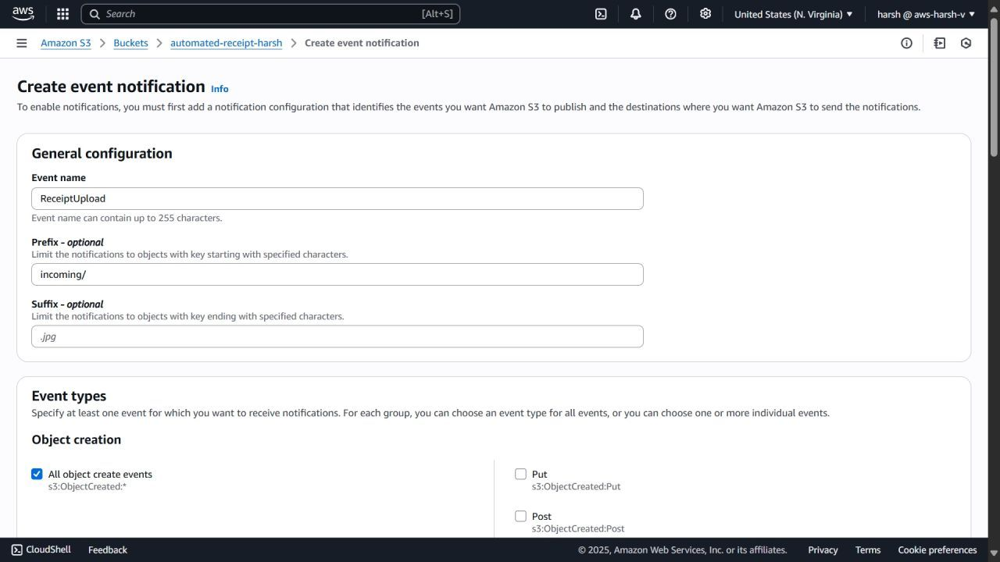
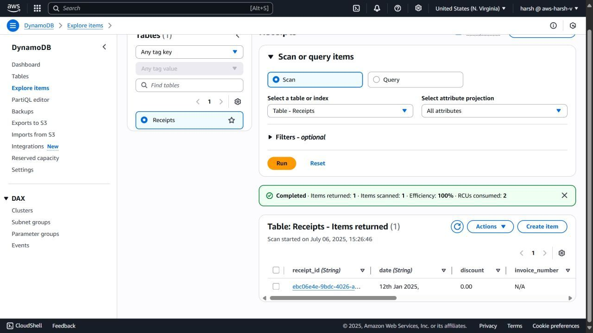
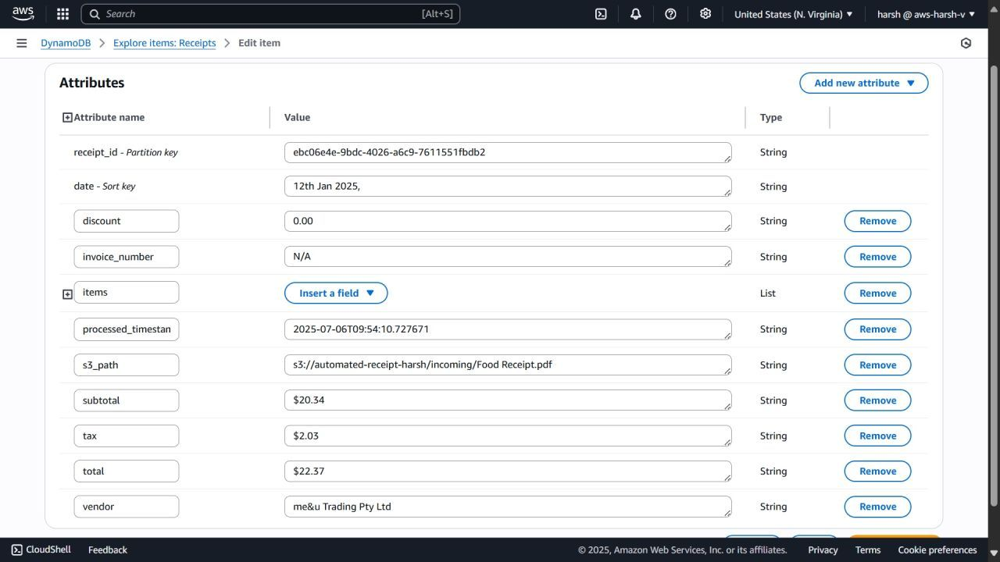
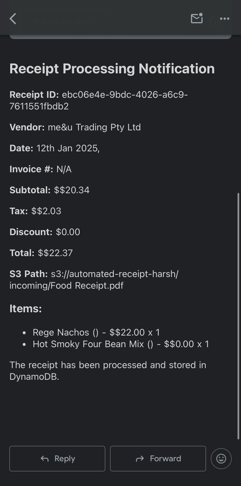
