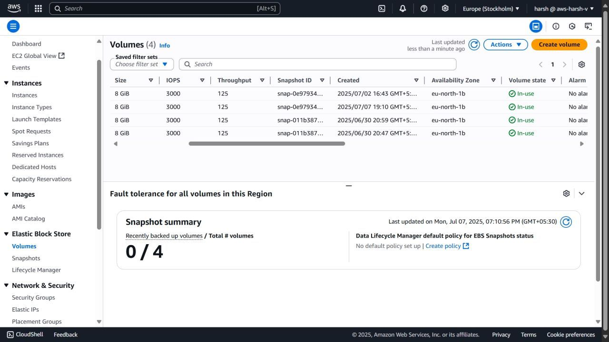
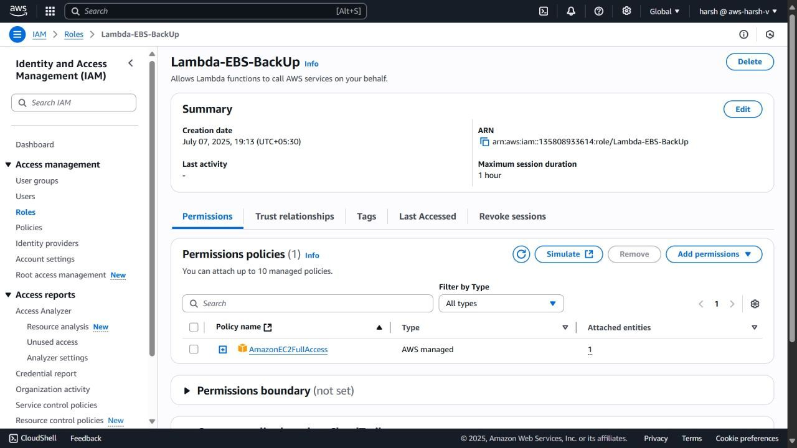
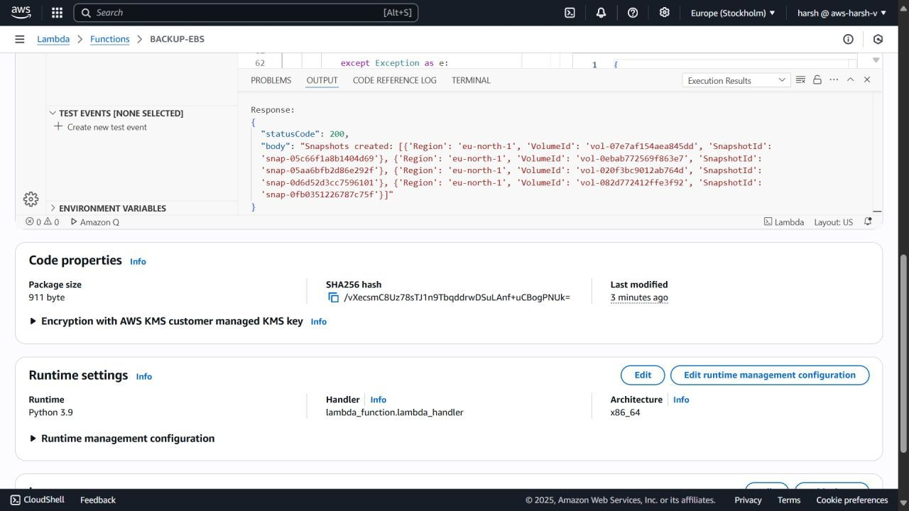
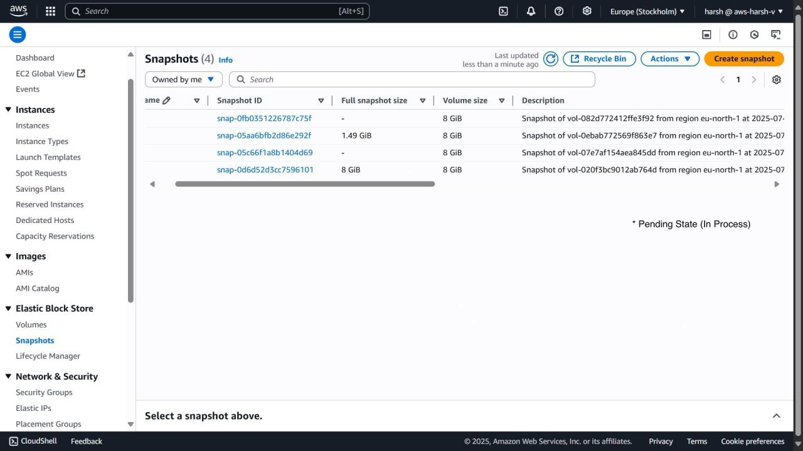

# Automated Multi-Region EBS Snapshot Backup Using AWS Lambda

This project automates the backup of **all in-use EBS volumes across every AWS region** using **AWS Lambda**, **Boto3**, and **EventBridge**. It is a scalable, serverless solution for ensuring regular snapshots of your critical EC2 storage volumes.


## Key Features

- Scans across all AWS regions dynamically.
- Filters EBS volumes that are actively in use.
- Creates snapshots automatically with custom metadata.
- Can be scheduled using Amazon EventBridge for daily or weekly backups.
- Follows the principle of least privilege for IAM roles.


## Architecture Diagram


### Workflow Summary:
1. EventBridge triggers Lambda on a schedule (e.g., daily at midnight).
2. Lambda function uses Boto3 to:
   - List all available AWS regions.
   - In each region, identify EBS volumes with `in-use` status.
   - Create a snapshot for each identified volume.
3. Snapshots are tagged with metadata: `Region`, `VolumeId`, and a descriptive label.


## Security Learning: Principle of Least Privilege

Initially, the Lambda function was assigned the `AmazonEC2FullAccess` policy. However, this was revised to align with best practices.

### Correct IAM Permissions:
```json
[
  "ec2:DescribeRegions",
  "ec2:DescribeVolumes",
  "ec2:CreateSnapshot",
  "ec2:CreateTags"
]
```

Why This Is Valuable in Production
For production environments, data durability and disaster recovery are critical. This solution ensures that all active storage volumes are regularly backed up across every AWS region, minimizing data loss risks due to hardware failures, human error, or malicious activity.

Tech Stack
- AWS Lambda – Serverless function execution
- Boto3 – Python SDK for AWS
- Amazon EBS – Elastic Block Store
- Amazon EventBridge – Scheduling and automation
- AWS IAM – Role-based access control

Directory Structure
```bash
.
├── README.md
├── lambda_function.py
└── screenshots
    ├── 1751906785013.jpg
    ├── 1751906785037.jpg
    ├── 1751906785043.jpg
    ├── 1751906785046.jpg
    ├── 1751906785056.jpg
    └── Architecture Diagram.png
```

Screenshots






